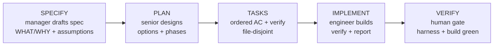

# Specs — `.agents/specs/` Index

> Living spec layer for Boss478. Specs describe WHAT/WHY before PLAN → TASKS → IMPLEMENT. Human reviews each gate. No code without spec for >30 min or >1 file tasks.

## Gated Workflow

Specs follow gated pipeline SPECIFY → PLAN → TASKS → IMPLEMENT. Manager owns spec quality (WHAT/WHY), senior-engineer owns plan scope (HOW), human approves each gate. TEMPLATE ensures completeness before code.



**Flow:** SPECIFY → PLAN → TASKS → IMPLEMENT. Each arrow is a human approval gate. TEMPLATE (<60L) gates SPECIFY; Plan gates PLAN; Tasks gate IMPLEMENT.

- Interview gate: for ambiguous/>30min features, manager interviews human via AskUserQuestion (technical, UI/UX, edge cases, tradeoffs) until assumptions concrete — block PLAN until corrected.
- Success Criteria must be verifiable: test/build/eval/screenshot + expected signal (e.g. `npm run eval -- <feature> green`, `LCP <2.5s`), not vague faster/better.
- Context: explore via subagents (explore/researcher/docs-lookup) to keep main context clean.

## Spec Index

| Spec | Status | Spec File | ADR / Plan | Purpose |
|------|--------|-----------|------------|---------|
| harness-70 | APPROVED | [harness-70.md](./harness-70.md) | [adr-harness-70.md](../plans/adr-harness-70.md) · [spec-infra-harness-70-plan.md](../plans/spec-infra-harness-70-plan.md) | Harness 66→70/70 — MCP + external_directory |
| spec-infra | APPROVED | [spec-infra.md](./spec-infra.md) | [adr-spec-infra.md](../plans/adr-spec-infra.md) · [spec-infra-harness-70-plan.md](../plans/spec-infra-harness-70-plan.md) | Establish `.agents/specs/` as source of truth |
| vocab-category-restructure | LEGACY | [vocab-category-restructure.md](./vocab-category-restructure.md) | [vocab-category-restructure-plan.md](../plans/vocab-category-restructure-plan.md) — pre-ADR | Pre-template vocab restructure (migrate on touch) |

> `harness-70.md` (143L) + `spec-infra.md` (171L) are APPROVED 2026-08-20 per senior REVISE. `vocab-category-restructure.md` is LEGACY — keep until next touch, then migrate to TEMPLATE. All specs live under `.agents/specs/` (git-tracked via `!.agents/specs/*.md`).

## Lifecycle & Badges

Specs use header badge `Status: DRAFT | APPROVED | IMPLEMENTING | DONE`. Badge is optional per spec, but README table is authoritative.

| Badge | Meaning | Next Gate |
|-------|---------|-----------|
| DRAFT | Drafting, assumptions open | Manager review |
| APPROVED | Human approved, ready for Plan | Plan phase |
| IMPLEMENTING | Tasks executing | Verify build/harness |
| DONE | Implemented + harness green + PR merged | Archive / memory |

Legend token for grep: `DRAFT|APPROVED|IMPLEMENTING|DONE`

**Transitions:** DRAFT → APPROVED (human) → IMPLEMENTING (TASKS start) → DONE (verify + harness 70/70 + build green). LEGACY = pre-template, not in flow — tracked for migration, no badge change needed.

## How to Create a New Spec

1. Copy template: `cp .agents/specs/TEMPLATE.md .agents/specs/<feature>.md`
2. Fill `## ASSUMPTIONS I'M MAKING:` first — surface ambiguities before Objective.
3. Complete 6 core areas + Boundaries + Success Criteria + Open Questions (TEMPLATE <60L).
4. Open PR linking spec `Success Criteria` — human approves gate.
5. After approval, Plan references spec; Tasks derive from Plan phases.
6. Implement increments; update spec if scope drifts (living doc).

See **[TEMPLATE.md](./TEMPLATE.md)** — canonical skeleton (<60 lines, `grep -c "^## " >=8`). Instantiated specs typical 100–200L. Copy succeeds in <1 min.

## File Conventions

- Location: `.agents/specs/` (agent-native, git-tracked via `!.agents/specs/` + `!.agents/specs/*.md`; `docs/specs/` rejected per ADR-021).
- Filename: `kebab-case.md` (e.g., `lawlib-phase2.md`, `grammar-castle-p1.md`).
- Header: `# Spec: [Feature]` + optional `Status:` badge (see Lifecycle).
- Assumptions block FIRST, before `## 1. Objective` (per skill `spec-driven-development`).
- Keep JSON keys sorted `$schema` → `mcp` → `permissions` → `commands`; no comments in JSON (document in ADR).
- Never use shell heredoc/echo for specs — `Write`/`Edit` only (snip hook corrupts `; `).
- Link to SDO for >1 file design depth (`.agents/templates/system-design-overview.md`) — don't duplicate.

## Verification

```
List:       ls -la .agents/specs/
Line count: wc -l .agents/specs/README.md          # 80–150 required
Flowchart:  grep -c "flowchart" .agents/specs/README.md  # >=1
Git track:  git check-ignore -v .agents/specs/README.md  # empty (not ignored)
Tracked:    git ls-files --error-unmatch .agents/specs/README.md  # after git add
Copy test:  cp .agents/specs/TEMPLATE.md /tmp/test-spec.md && ls /tmp/test-spec.md
Harness:    node scripts/harness-audit.js repo --format text  # expect 70/70 post-fix
Build:      npm run build && npm run lint && npm run typecheck  # specs ignored via .agents/**
```

## Related Docs

- Plan (REVISED): [spec-infra-harness-70-plan.md](../plans/spec-infra-harness-70-plan.md)
- Implementation Plan: [implementation-plan-spec-infra-harness.md](../plans/implementation-plan-spec-infra-harness.md)
- ADRs: [adr-spec-infra.md](../plans/adr-spec-infra.md) (D3/D4/D5/D6) · [adr-harness-70.md](../plans/adr-harness-70.md) (D1/D2/D6) · [adr-013-hosting-migration-visperhost.md](../plans/adr-013-hosting-migration-visperhost.md)
- Skill: `spec-driven-development` (TEMPLATE source: 6 areas + boundaries + success + open Q)
- SDO ref (for >1 file): `.agents/templates/system-design-overview.md` (linked from specs when needed)
- Memory: `.agents/memory.md` | Tasks: `.agents/tasks/todo.md` | Report: `.agents/report/`

## Risks & Notes

- Stale specs → living doc rule: update spec BEFORE code when scope changes (verify gate checks PR link).
- Snip corruption → Write/Edit only, never shell heredoc/echo.
- Gitignore drift → verify `git check-ignore -v` + `git ls-files --error-unmatch` per task; fallback `git add -f` if negations missing.
- Harness 0 cost → docs+config only, 0 DB queries, <100ms local, no runtime impact until VisperHost (ADR-013).
- Pool 3 unchanged — spec infra has no DB load.

---

*Index maintained by manager. Human approves status transitions. Last sync: 2026-08-20 (APPROVED specs harness-70 + spec-infra, REVISED plan).*
